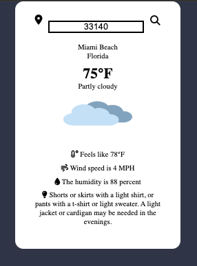

# Weather Wear App

The Weather Wear App is a web application that provides real-time weather information and suggests appropriate clothing based on the current weather conditions. It utilizes the WeatherAPI to fetch weather data and uses JavaScript, CSS, and HTML for the implementation.

To use the Weather Wear App, follow these steps:

```
1. Clone the repository.
2. Extract the files to a directory of your choice.
3. Obtain an API key from the WeatherAPI website (https://www.weatherapi.com/).
4. Put your API key in line 6 under "apiKey"
5. Save the changes.
```

The app is now ready to be used.


## How to Play
1. Open the index.html file in your preferred web browser.
2. The WeatherWear App will load and you can put your city or zip code.
3. You will see the temperature, humidity, wind speed, and suggestion on attire.
4. Based on the weather conditions, the app will provide clothing suggestions to help you dress appropriately.
5. The suggestions may include recommendations for outfits, accessories, or protective gear.
6. You can also search for weather information in other locations by entering a city name or ZIP code in the search bar.
7. Press the "Search" button or hit Enter to fetch the weather data for the specified location.
## Features

- Fetches real-time weather data from the WeatherAPI.
- Displays current weather conditions, including temperature, humidity, wind speed, and weather description.
- Provides clothing suggestions based on the current weather conditions.
- Allows manual search for weather information in other locations.
- Offers a user-friendly and responsive interface.

## Screenshots




## Tech Stack

**Client:** HTML, CSS, JavaScript

## Authors

- [@juanedcabrera](https://www.github.com/juanedcabrera)


## License

[MIT](https://choosealicense.com/licenses/mit/)

